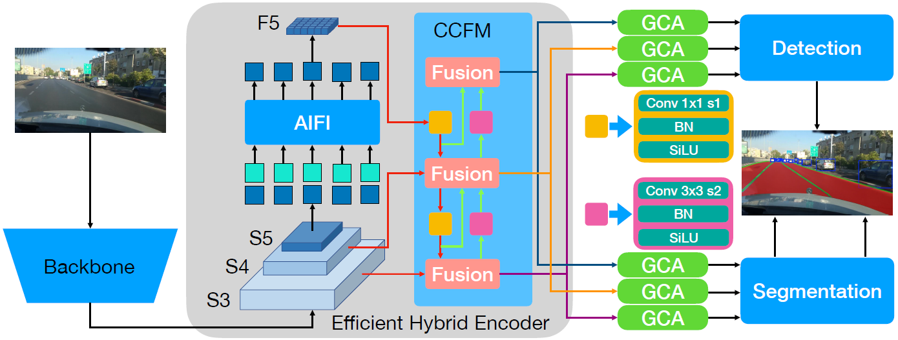
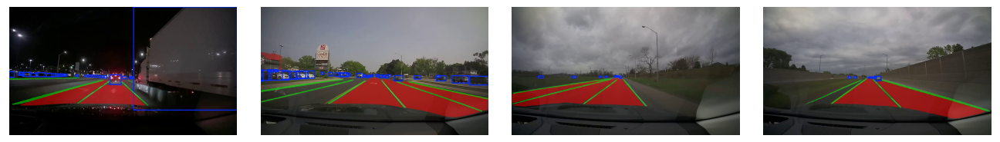

<div align="left">   


## RMT-PPAD: Real-time Multi-task Learning for Panoptic Perception in Autonomous Driving
This repository is the official PyTorch implementation of the paper "RMT-PPAD: Real-time Multi-task Learning for Panoptic Perception in Autonomous Driving".  

> [**RMT-PPAD: Real-time Multi-task Learning for Panoptic Perception in Autonomous Driving**](https://arxiv.org/abs/2508.06529)
>
> by [Jiayuan Wang](https://scholar.google.ca/citations?user=1z6x5_UAAAAJ&hl=zh-CN&oi=ao), [Q. M. Jonathan Wu](https://scholar.google.com/citations?user=BJSAsE8AAAAJ&hl=zh-CN)<sup> :email:</sup>, [Katsuya Suto](https://scholar.google.com/citations?user=x3oJXHwAAAAJ&hl=ja), and [Ning Zhang](https://scholar.google.ca/citations?hl=zh-CN&user=ZcYihtoAAAAJ)
>
>  (<sup>:email:</sup>) corresponding author.


---

### The Illustration of RMT-PPAD



### Contributions

* We design a real-time transformer-based multi-task model (RMT-PPAD) without bells and whistles that jointly addresses object detection, drivable area segmentation, and lane line segmentation in a single network.
* We propose a lightweight GCA module, which extracts task-specific features, retains shared representations, and adaptively fuses them to alleviate negative transfer between tasks.
* We design an adaptive segmentation decoder that learns task-specific weights for multi-scale features automatically. This eliminates the need for manually designed task-specific structures while balancing fine details and global context.
* We identify the inconsistency between the lane line label widths used for training and testing in previous works. For a fair and true reflection of the model’s lane line segmentation performance, we propose a simple yet effective method to dilate the test label widths to the same as the train dataset.
* We conduct extensive experiments and ablation studies on the BDD100K dataset and real-world driving scenarios to validate the effectiveness of RMT-PPAD, which achieves SOTA performance across all tasks compared to open-source MTL models for panoptic driving perception.

### Results

<h3> Quantitative results comparison of RMT-PPAD and open-source MTL models on BDD100K</h3>

<table>
  <thead>
    <tr>
      <th rowspan="2">Model</th>
      <th rowspan="2">FPS</th>
      <th rowspan="2">Params (M)</th>
      <th colspan="2">Object Detection</th>
      <th>Drivable Area</th>
      <th colspan="2">Lane Line</th>
    </tr>
    <tr>
      <th>Recall (%)</th>
      <th>mAP50 (%)</th>
      <th>mIoU (%)</th>
      <th>IoU (%)</th>
      <th>ACC (%)</th>
    </tr>
  </thead>
  <tbody>
    <tr><td>YOLOP</td><td><b>64.5</b></td><td>7.9</td><td>88.5</td><td>76.4</td><td>89.0</td><td>44.0</td><td>79.8</td></tr>
    <tr><td>HybridNet</td><td>17.2</td><td>12.8</td><td>93.5</td><td>77.2</td><td>91.0</td><td>52.0</td><td>82.7</td></tr>
    <tr><td>YOLOPX</td><td>27.5</td><td>32.9</td><td>93.7</td><td>83.3</td><td>90.9</td><td>52.1</td><td>79.1</td></tr>
    <tr><td>A-YOLOM(n)</td><td>52.9</td><td><b>4.4</b></td><td>85.3</td><td>78.0</td><td>90.5</td><td>45.6</td><td>77.2</td></tr>
    <tr><td>A-YOLOM(s)</td><td>52.7</td><td>13.6</td><td>86.9</td><td>81.1</td><td>91.0</td><td>49.7</td><td>80.7</td></tr>
    <tr><td>RMT-PPAD</td><td>32.6</td><td>34.3</td><td><b>95.4</b></td><td><b>84.9</b></td><td><b>92.6</b></td><td><b>56.8</b></td><td><b>84.7</b></td></tr>
  </tbody>
</table>

#### Ablation study on MTL and GCA

| Methods                    | Recall (%) | mAP50 (%) | mIoU (%) | IoU (%) | ACC (%) |
|----------------------------|------------|-----------|----------|---------|---------|
| Object only                | 92.1       | 77.5      | –        | –       | –       |
| Drivable area only         | –          | –         | 91.0     | –       | –       |
| Lane line only             | –          | –         | –        | 53.2    | 85.3    |
| Segmentation only          | –          | –         | 91.3     | 53.3    | 85.4    |
| vanilla MTL                | 92.4       | 76.9      | 91.0     | 52.4    | 83.6    |
| MTL with GCA (RMT-PPAD)    | 92.1       | 78.3      | 91.3     | 52.7    | 84.1    |


<h3>Ablation Studies for segmentation performance at different confidence thresholds on toy and BDD100K.  </h3>
<p><em>mIoU for drivable area segmentation; IoU and ACC for lane line segmentation.</em></p>

<table>
  <thead>
    <tr>
      <th rowspan="2">Threshold</th>
      <th colspan="3">Toy</th>
      <th colspan="3">BDD100K</th>
    </tr>
    <tr>
      <th>mIoU (%)</th>
      <th>IoU (%)</th>
      <th>ACC (%)</th>
      <th>mIoU (%)</th>
      <th>IoU (%)</th>
      <th>ACC (%)</th>
    </tr>
  </thead>
  <tbody>
    <tr><td>0.40</td><td><b>91.3</b></td><td>48.8</td><td>88.9</td><td><b>92.6</b></td><td>53.7</td><td><b>89.4</b></td></tr>
    <tr><td>0.45</td><td><b>91.3</b></td><td>49.2</td><td>88.7</td><td><b>92.6</b></td><td>54.0</td><td>89.1</td></tr>
    <tr><td>0.50</td><td>91.1</td><td>49.6</td><td>88.4</td><td>92.4</td><td>54.3</td><td>88.9</td></tr>
    <tr><td>0.55</td><td>90.9</td><td>50.0</td><td>88.2</td><td>92.1</td><td>54.6</td><td>88.7</td></tr>
    <tr><td>0.60</td><td>90.4</td><td>50.3</td><td>87.9</td><td>91.7</td><td>55.0</td><td>88.4</td></tr>
    <tr><td>0.65</td><td>89.8</td><td>50.6</td><td>87.5</td><td>91.0</td><td>55.2</td><td>88.1</td></tr>
    <tr><td>0.70</td><td>89.0</td><td>51.0</td><td>87.2</td><td>90.3</td><td>55.5</td><td>87.7</td></tr>
    <tr><td>0.75</td><td>88.1</td><td>51.4</td><td>86.7</td><td>89.5</td><td>55.9</td><td>87.3</td></tr>
    <tr><td>0.80</td><td>87.1</td><td>51.8</td><td>86.2</td><td>88.5</td><td>56.3</td><td>86.8</td></tr>
    <tr><td>0.85</td><td>85.9</td><td>52.3</td><td>85.4</td><td>87.4</td><td>56.6</td><td>86.0</td></tr>
    <tr><td>0.90</td><td>84.2</td><td><b>52.7</b></td><td>84.1</td><td>85.9</td><td><b>56.8</b></td><td>84.7</td></tr>
    <tr><td>0.95</td><td>80.9</td><td>52.1</td><td>81.0</td><td>83.4</td><td>55.8</td><td>81.5</td></tr>
  </tbody>
</table>

  
**Notes**: 

- The works we have used for reference include `YOLOP`([paper](https://link.springer.com/article/10.1007/s11633-022-1339-y),[code](https://github.com/hustvl/YOLOP)), `HybridNets`([paper](https://arxiv.org/abs/2203.09035),[code](https://github.com/datvuthanh/HybridNets)), `YOLOPX`([paper](https://www.sciencedirect.com/science/article/pii/S003132032300849X),[code](https://github.com/jiaoZ7688/YOLOPX)), `A-YOLOM`([paper](https://ieeexplore.ieee.org/document/10509552),[code]([https://github.com/ultralytics/ultralytics](https://github.com/JiayuanWang-JW/YOLOv8-multi-task))). Thanks for their wonderful works.


---

### Visualization

#### Real Road



---


### Requirement

This codebase has been developed with [**Python==3.8.19**](https://www.python.org/) with [**PyTorch==2.4.1**](https://pytorch.org/get-started/locally/).

```setup
cd RMT-PPAD
conda env create -f environment.yml
conda activate RMTPPAD
cd ultralytics
python -m pip install -e .
```

### Data preparation and Pre-trained model

### Note:
Since we extended the label size for lane line testing, please use our provided dataset to reproduce the results reported in the paper. Further details are described in the paper.

#### Download

- Download the images from [images](https://bdd-data.berkeley.edu/).

- Pre-trained model: [RMT-PPAD](https://uwin365-my.sharepoint.com/:u:/g/personal/wang621_uwindsor_ca/EVvXPuqxXdRAkIuAVdth14gBYKuDJ6XqlA2ppRHsmeQN_w?e=hKcXJX).
  
- Download the annotations of detection from [labels](https://uwin365-my.sharepoint.com/:u:/g/personal/wang621_uwindsor_ca/EV2FyiQg0llNpBL2F5hnEi0BwfEFTP3jckw7adfLSXPzrQ?e=jSaTOO). 
- Download the annotations of lane line segmentation and drivable area segmentation from [mask](https://uwin365-my.sharepoint.com/:u:/g/personal/wang621_uwindsor_ca/EXrUtDWQ5vlAgzaGopIC3foBZXbs5JNNJRgvR4XotO2cgg?e=CVLOHg).

We recommend the dataset directory structure to be the following:

```
├─dataset root
│ ├─images
│ │ ├─train2017
│ │ ├─val2017
│ ├─labels
│ │ ├─train2017
│ │ ├─val2017
│ ├─mask
│ │ ├─lane
│ │ │ ├─train2017
│ │ │ ├─val2017
│ │ ├─drivable
│ │ │ ├─train2017
│ │ │ ├─val2017
```

Update the your dataset path in the `./ultralytics/datasets/bdd-multi.yaml`.

### Training

You can set the training configuration in the `./ultralytics/yolo/cfg/default.yaml`.


```
python train.py
```
You can change the setting in train.py


### Evaluation

You can set the evaluation configuration in the `./ultralytics/yolo/cfg/default.yaml`


```
python test.py
```
You can change the setting in test.py


### Prediction

```
python predict.py
```
You can change the setting in predict.py


## Citation

If you find our paper and code useful for your research, please consider giving a star :star:   and citation :pencil: :

```BibTeX
@ARTICLE{2025arXiv250806529W,
       author = {{Wang}, Jiayuan and {Wu}, Q.~M. Jonathan and {Suto}, Katsuya and {Zhang}, Ning},
        title = {RMT-PPAD: Real-time Multi-task Learning for Panoptic Perception in Autonomous Driving},
      journal = {arXiv e-prints},
     keywords = {Computer Vision and Pattern Recognition, Machine Learning},
         year = 2025,
        month = aug,
          eid = {arXiv:2508.06529},
        pages = {arXiv:2508.06529},
archivePrefix = {arXiv},
       eprint = {2508.06529}
}
```
